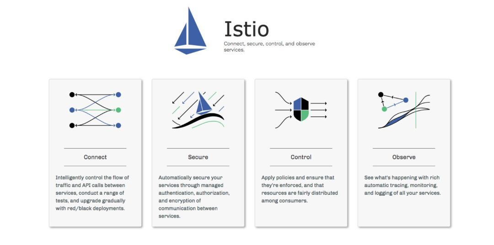

# istio最佳实践
- # 目录
    - [功能实践](功能实践/README.md)
      
      - [安全](功能实践/安全/README.md)
        * [认证](功能实践/安全/认证.md)
        * [授权](功能实践/安全/授权.md)
      - [策略](功能实践/策略/README.md)
      - [工具](功能实践/工具/README.md)
        * [Fortio](功能实践/工具/fortio.md)
      - [可观察性](功能实践/可观察性/README.md)
        * [指标](功能实践/可观察性/指标.md)
        * [Grafana](功能实践/可观察性/grafana.md)
        * [Kiali](功能实践/可观察性/kiali.md)
      - [流量管理](功能实践/流量管理/README.md)
        * [1.基础路由与入口网关](功能实践/流量管理/1.基础路由与入口网关.md)
        * [2.灰度发布与版本管理](功能实践/流量管理/2.灰度发布与版本管理.md)
        * [3.高级路由](功能实践/流量管理/3.高级路由.md)
        * [4.熔断与限流](功能实践/流量管理/4.熔断与限流.md)
        * [5.混沌工程-流量镜像与故障注入](功能实践/流量管理/5.混沌工程-流量镜像与故障注入.md)
        * [6.出口控制](功能实践/流量管理/6.出口控制.md)
        * [7.出口网关](功能实践/流量管理/7.出口网关.md)
      - [其他](功能实践/其他/README.md)
        * [sidecar注入](功能实践/其他/sidecar注入.md)
      - [生产环境实践](功能实践/生产环境实践/README.md)
        * [访问webUi](功能实践/生产环境实践/访问webUi.md)
        * [数据持久化](功能实践/生产环境实践/数据持久化.md)
      
    - 扩展
    
      * [Mixer](扩展/Mixer.md)
      * [Web Assembly](扩展/WebAssembly.md)
    
    - [其他](其他/README.md)
    
      - [Kiali 使用指南](其他/Kiali 使用指南/README.md)
    
      * [发展历程](其他/发展历程.md)
      * [性能](其他/性能.md)
      * [envoy配置](其他/envoy配置.md)
      * [istio安装](其他/istio安装.md)
      * [Kiali Operator](其他/kiali-operator.md)
    
    - [问题收集](问题收集/README.md)
    
      * [http策略不生效](问题收集/http策略不生效.md)
      * [Kiali Permission Denied In Openshift](问题收集/kiali_permission_denied_in_openshift.md)
      * [Sidecar 503](问题收集/sidecar_503.md)
    
    - 源码解析
    
      * [Istio Ca](源码解析/istio_ca.md)
      * [Kiali](源码解析/kiali.md)
      * [Pilot Agent](源码解析/pilot-agent.md)
      * [Pilot Discovery](源码解析/pilot-discovery.md)
    
    - [诊断](诊断/README.md)
    
      * [Istioctl](诊断/istioctl.md)

## istio介绍

随着分布式系统的复杂性的提高，服务管理的难度也越来越高，服务治理是目前分布式系统管理的一个重要关注点，前几年service mech的横空出世，给服务治理带来了希望，而istio是目前最流行的service mech框架之一。

用一句话概括istio，就是“连接、安全加固、控制和观察服务的开放平台”

istio提供如下应用场景：

1. 流量管理：可以自由的控制服务之间的调用流量，轻松实现灰度升级、AB测试、混沌工程等功能。

2. 安全加固：可以保证服务之间的安全调用，提高了分布式系统的安全性。

3. 可观察性：提供日志、监控、调用链等观察方式，可以s快速定位庞大的微服务系统中出现的异常，更好地观察和治理服务。

4. 控制性：应用用户定义的策略，保证资源在消费者中公平分配。

istio相对于其他服务治理框架有如下特定：

1. 无侵入性：相对于spring cloud与dubbo等流行框架，istio可以以无侵入式的方式接入，无论你的应用是基于java，python还是golang编写。

2. 完美兼容容器和kubernetes：kubernetes是目前主流的容器云平台，配合istio，可以补充kubernetes作为微服务框架所缺少的部分功能(熔断、限流等)，同时加强集群的网络管理和安全防御功能

目前istio还在快速迭代更新中，在新的版本中对架构进行优化，提高可扩展性，同时提高了对虚拟机的支持，可以更好的兼容传统应用，为企业/政府机关上云提供了更可靠的支持。
