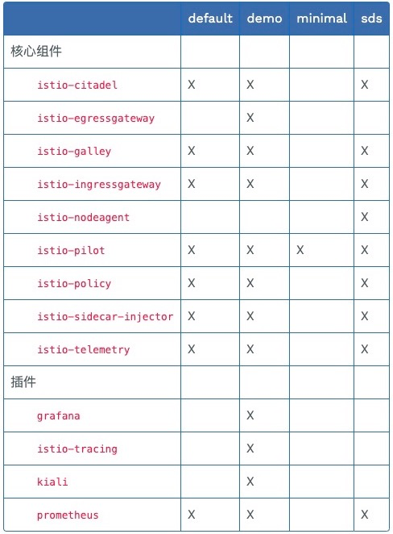

# 最佳实践-istio安装

官方目前helm不支持helm3，而且以后也不推荐使用helm进行安装，故按照官方推荐使用istioctl进行安装.

## 下载并安装二进制文件

```text
# mac用户
wget https://github.com/istio/istio/releases/download/1.5.2/istioctl-1.5.2-osx.tar.gz

# window用户
下载 https://github.com/istio/istio/releases/download/1.5.2/istio-1.5.2-win.zip

# linux用户
wget https://github.com/istio/istio/releases/download/1.5.2/istio-1.5.2-linux.tar.gz


tar -xvzf istioctl-1.5.2-osx.tar.gz
mv istioctl /usr/local/bin/
```

## 安装配置

您可以从 Istio 内置配置文件的其中一个开始入手，然后根据您的特定需求进一步自定义配置文件。当前提供以下几种内置配置文件:

- default: 根据默认的安装选项启用组件 (建议用于生产部署)。
- demo: 这一配置具有适度的资源需求，旨在展示 Istio 的功能。它适合运行 Bookinfo 应用程序和相关任务。 这是通过快速开始指导安装的配置，但是您以后可以通过自定义配置 启用其他功能来探索更高级的任务。
  此配置文件启用了高级别的追踪和访问日志，因此不适合进行性能测试。
- minimal: 使用 Istio 的流量管理功能所需的最少组件集。
- sds: 和 default 配置类似，但是启用了 Istio 的 SDS (secret discovery service) 功能。 这个配置文件默认启用了附带的认证功能 (Strict Mutual TLS)。

下表中标记为 X 的组件就是包含在配置文件里的内容:


## 安装

最全安装

```text
istioctl manifest apply --set profile=demo
```

自定义安装

```text
istioctl manifest apply --set addonComponents.Grafana.enabled=true
```

# 卸载

```text
istioctl manifest generate| kubectl delete -f -
```


## 检测

```
istioctl
```


## 问题

1.6 安装出现下面问题

Detected that your cluster does not support third party JWT authentication. Falling back to less secure first party JWT. See https://istio.io/docs/ops/best-practices/security/#configure-third-party-service-account-tokens for details.


1.6不推荐使用k8s自身的serviceaccount，推荐使用第三方的，但是还是可以安装过去