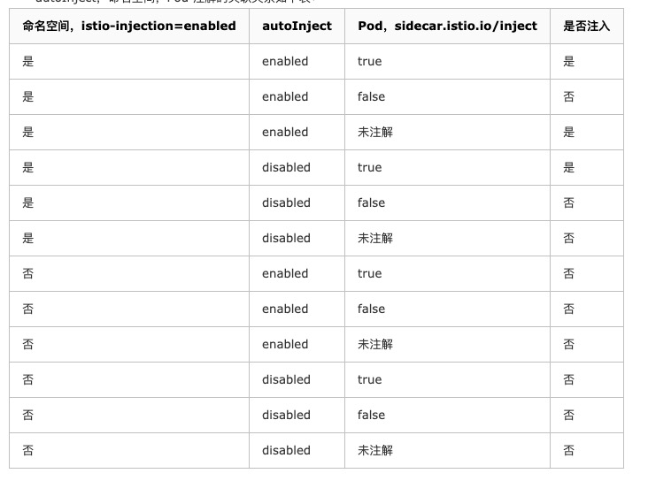

# sidecat注入

在istio 网络中，只有注入sdiecar才能进入网络。

注入side一共有如下几种方式

- 手动注入

  ```
  istioctl kube-inject -f samples/sleep/sleep.yaml | kubectl apply -f -
  ```

- 自动注入 sidecar,

  - 控制namespace，增加一个label

    ```
    kubectl label namespace default istio-injection=enabled
    ```

  - 控制pod, 增加一个注解

    ```
    sidecar.istio.io/inject: "true"
    ```


## 手动注入

在执行istioctl kube-inject命令的时候会自动修改原本的yaml文件，加上initcontain和sidecar容器等其他配置。deployment会被修改。


## 自动注入

依靠准入控制器实现，在创建pod的时候会通过准入控制器（MutatingAdmissionWebhook 和ValidatingAdmissionWebhook），修改最终创建的pod，注入sidecar，deployment等还是保持原样。


## 开启准入控制器

### kubernetes

可以通过该命令检查默认开启哪些准入控制器

```
kube-apiserver -h | grep enable-admission-plugins
```

新版本默认开启了, 可以通过下面进行开启

```
--enable-admission-plugins=MutatingAdmissionWebhook,ValidatingAdmissionWebhook
```


### openshift

##  openshift 开启准入控制器

```
# cat /etc/origin/master/master-config.yaml
admissionConfig:
  pluginConfig:
    MutatingAdmissionWebhook:
      configuration:
        apiVersion: apiserver.config.k8s.io/v1alpha1
        kind: WebhookAdmission
        kubeConfigFile: /dev/null
    ValidatingAdmissionWebhook:
      configuration:
        apiVersion: apiserver.config.k8s.io/v1alpha1
        kind: WebhookAdmission
        kubeConfigFile: /dev/null
```
```
/usr/local/bin/master-restart api
/usr/local/bin/master-restart controllers
```


## 其他配置和优先级


优先级



