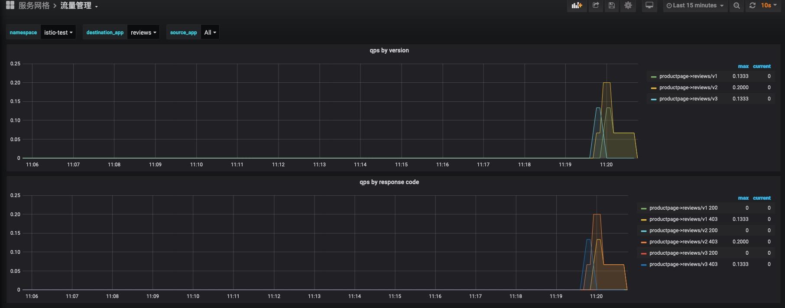

# grafana

## 官方仪表盘

默认安装已经包含如下仪表盘

- Istio Control Plane Dashboard 

  控制平面的监控信息、包括控制面的硬件资源使用情况(内存、cpu、磁盘)；pilot的监控指标；XDS的请求指标等

- Istio Mesh Dashboard 

  网络的请求状态，包括4xx、5xx的统计；负载的http/GRPC/TCP请求情况

- Istio Mixer Dashboard 

  Mixer的监控指标，包括mix的硬件资源使用,适配器和配置等等

- Istio Performance Dashboard 

  性能监控指标，包括组件硬件资源使用情况，代理硬件资源使用情况等等

- Istio Service Dashboard 

- Istio Workload Dashboard 


也可以提供以下脚本导入

```
# Address of Grafana
GRAFANA_HOST="http://grafana.istio.k8stest.top:30000"
# Login credentials, if authentication is used
GRAFANA_CRED="admin:123456"
# The name of the Prometheus data source to use
GRAFANA_DATASOURCE="Prometheus"
# The version of Istio to deploy
VERSION=1.6
# Import all Istio dashboards
for DASHBOARD in 7639 11829 7636 7630 7642 7645; do
    REVISION="$(curl -s https://grafana.com/api/dashboards/${DASHBOARD}/revisions -s | jq ".items[] | select(.description | contains(\"${VERSION}\")) | .revision")"
    curl -s https://grafana.com/api/dashboards/${DASHBOARD}/revisions/${REVISION}/download > /tmp/dashboard.json
    echo "Importing $(cat /tmp/dashboard.json | jq -r '.title') (revision ${REVISION}, id ${DASHBOARD})..."
    curl -s -k -u "$GRAFANA_CRED" -XPOST \
        -H "Accept: application/json" \
        -H "Content-Type: application/json" \
        -d "{\"dashboard\":$(cat /tmp/dashboard.json),\"overwrite\":true, \
            \"inputs\":[{\"name\":\"DS_PROMETHEUS\",\"type\":\"datasource\", \
            \"pluginId\":\"prometheus\",\"value\":\"$GRAFANA_DATASOURCE\"}]}" \
        $GRAFANA_HOST/api/dashboards/import
    echo -e "\nDone\n"
done
```


## 自己编写的仪表盘

在src/grafana目录

### 流量管理


