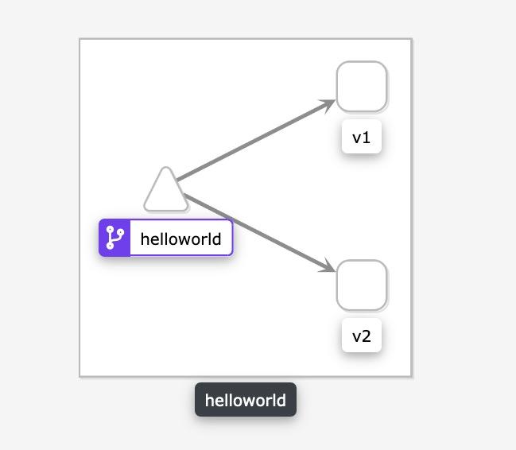

# 基础路由与网关


这里创建了kubernetes很常见的应用，2个deployment 和1个service，区别就是2个deployment中的label一个是version: v1 一个是 version: v2

```
kubectl apply -f samples/helloworld/helloworld.yaml
```

```
apiVersion: v1
kind: Service
metadata:
  name: helloworld
  labels:
    app: helloworld
spec:
  ports:
  - port: 5000
    name: http
  selector:
    app: helloworld
---
apiVersion: apps/v1
kind: Deployment
metadata:
  name: helloworld-v1
  labels:
    version: v1
spec:
  replicas: 1
  selector:
    matchLabels:
      app: helloworld
      version: v1
  template:
    metadata:
      labels:
        app: helloworld
        version: v1
    spec:
      containers:
      - name: helloworld
        image: docker.io/istio/examples-helloworld-v1
        resources:
          requests:
            cpu: "100m"
        imagePullPolicy: IfNotPresent #Always
        ports:
        - containerPort: 5000
---
apiVersion: apps/v1
kind: Deployment
metadata:
  name: helloworld-v2
  labels:
    version: v2
spec:
  replicas: 1
  selector:
    matchLabels:
      app: helloworld
      version: v2
  template:
    metadata:
      labels:
        app: helloworld
        version: v2
    spec:
      containers:
      - name: helloworld
        image: docker.io/istio/examples-helloworld-v2
        resources:
          requests:
            cpu: "100m"
        imagePullPolicy: IfNotPresent #Always
        ports:
        - containerPort: 5000
```

## 创建一个istio-gateway


```
kubectl apply -f samples/helloworld/helloworld-gateway.yaml
```

```
apiVersion: networking.istio.io/v1alpha3
kind: Gateway
metadata:
  name: helloworld-gateway
spec:
  selector:
    istio: ingressgateway # use istio default controller
  servers:
  - port:
      number: 80
      name: http
      protocol: HTTP
    hosts:
    - "*"
---
apiVersion: networking.istio.io/v1alpha3
kind: VirtualService
metadata:
  name: helloworld
spec:
  hosts:
  - "*"
  gateways:
  - helloworld-gateway
  http:
  - match:
    - uri:
        exact: /hello
    route:
    - destination:
        host: helloworld
        port:
          number: 5000
```


创建以后访问 http://test.istio.k8stest.top:30000/hello 可以发现可以随机访问到v1版本和v2版本的服务。打开kilai以后可以看到以下图。




其实上面的规则Gateway + VirtualService 实现的效果和k8s中的ingress是一致的，如果转化成为ingress和如下的规则是一致的。

```
apiVersion: networking.k8s.io/v1beta1
kind: Ingress
metadata:
  name: helloworld-ingress
  annotations:
    nginx.ingress.kubernetes.io/rewrite-target: /
spec:
  rules:
  - http:
      paths:
      - path: /hello
        backend:
          serviceName: helloworld
          servicePort: 5000
```

那么为什么还要那么多次一举，使用Gateway + VirtualService代替ingress呢

那么有如下几个好处

1. ingress 规则只能做网关->内部服务之间的路由，而Gateway + VirtualService的组合即可以做网关->内部服务，也可以做内部服务->内部服务的路由。

   因为不管是Gateway 还是sidecar都是envoy，所以配置都是一样

2. 在VirtualService上可以实现很多策略，比如故障注入、流量转移等功能，本质上都是envoy的功能。普通的ingress因为比较抽象，而且每种ingress控制器策略配置都不同，最多也就是在annotations中配置。

3. VirtualService 还可以搭配*DestinationRule*完成其他功能，比如灰度发布，单靠ingress比较难管理
