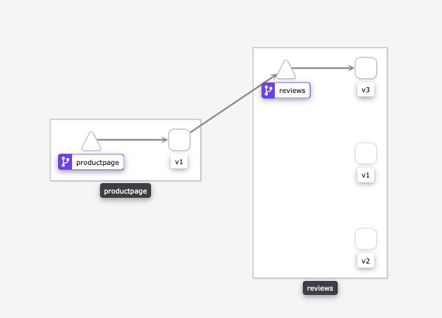
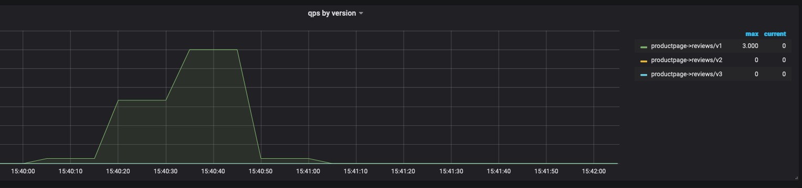
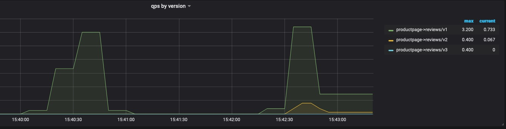
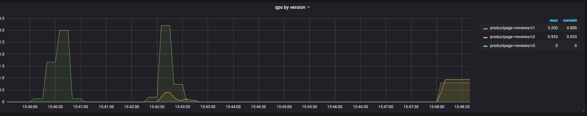
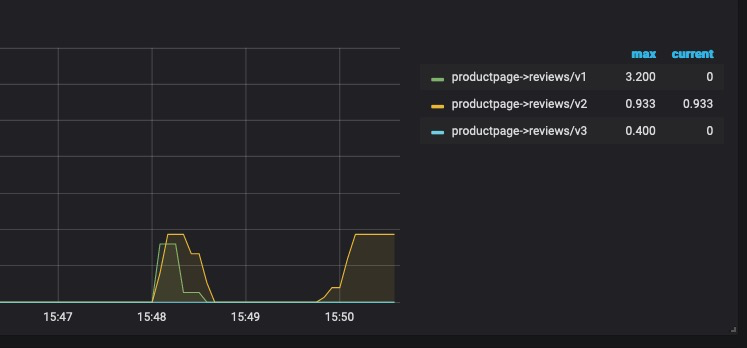

# 灰度发布与版本管理

首先先来安装官方的案例-bookinfo

```
kubectl apply -f samples/bookinfo/platform/kube/bookinfo.yaml

kubectl apply -f samples/bookinfo/networking/bookinfo-gateway.yaml

kubectl apply -f samples/bookinfo/networking/destination-rule-all.yaml
```


## 版本管理

在基础路由中，我们已经知道Gateway + VirtualService 的组合可以代替k8s 原生ingress的功能，但是也只是和ingress一样。只能路由到service，pod之前还是使用随机轮训的方式进行访问。那么需要如何准确访问到具体的pod呢？

那么就需要用到*DestinationRule*这个资源对象，顾名思义就是对目标(pod) 定义规则，如何选择pod，那么一定还是label。

我们看到官方的demo，就拿reviews这个应用来说明

```
samples/bookinfo/networking/destination-rule-reviews.yaml
```

```
apiVersion: networking.istio.io/v1alpha3
kind: DestinationRule
metadata:
  name: reviews
spec:
  host: reviews
  subsets:
  - name: v1
    labels:
      version: v1
  - name: v2
    labels:
      version: v2
  - name: v3
    labels:
      version: v3
```

可以看到subsets这个属性下面定义了3个items，设置了3个labels，分别对应了pod的version标签，命名为v1、v2、v3，通过DestinationRule给每个目标设置了一个name。

然后通过VirtualService的destination属性设置subset为v3，那么也就只会访问到labels 为 version=v3的pod。当然也可以设置多个，如果默认不设置策略，多个也就是随机访问的。

```
samples/bookinfo/networking/virtual-service-reviews-v3.yaml
```

```
apiVersion: networking.istio.io/v1alpha3
kind: VirtualService
metadata:
  name: reviews
spec:
  hosts:
    - reviews
  http:
  - route:
    - destination:
        host: reviews
        subset: v3
```

然后可以看到kilai中可以productpage只有访问到v3笨笨的reviews



## 灰度发布

在一般情况下，升级服务器端应用，需要将应用源码或程序包上传到服务器，然后停止掉老版本服务，再启动新版本。但是这种简单的发布方式存在两个问题，一方面，在新版本升级过程中，服务是暂时中断的，另一方面，如果新版本有BUG，升级失败，回滚起来也非常麻烦，容易造成更长时间的服务不可用。

为了解决这些问题，人们研究出了多种发布策略，这里主要介绍一下灰度发布。

灰度发布也叫金丝雀发布，起源是，矿井工人发现，金丝雀对瓦斯气体很敏感，矿工会在下井之前，先放一只金丝雀到井中，如果金丝雀不叫了，就代表瓦斯浓度高。


可以在promehteus或者grafana输入该查询语句查看当前版本的流量情况，这里我们主要观察review的流量情况，review存在3个版本
```
sum(irate(istio_requests_total{destination_app="reviews"}[1m])) by (destination_canonical_revision,destination_app)
```

可以看到默认的情况下有三个版本、而且版本都比较接近


### 开始灰度发布实验

这个实验中，我们一开始以review 的v1版本对外提供服务。灰度升级的时候，先尝试将一半流量导入V3版本的服务。这样可以将一部分新版本的功能提供给一半的人体验，如有问题也不会影响所有的人，可以快速回滚。待新版本运行稳定后，会将v1的流量逐步全部切换到v3版本，这样也就升级完毕。
#### 1. 版本v1运行
首先我们尝试切换到版本v1，模拟旧版本，目前流量全部都进入了v1版本

```
kubectl apply -f samples/bookinfo/networking/virtual-service-all-v1.yaml
```




#### 2.开始灰度发布
我们尝试将v1版本的20%流量导入到v2	版本

```
kubectl apply -f samples/bookinfo/networking/virtual-service-reviews-80-20.yaml
```



![image-20200616175401832](.assets/image-20200616175401832.png

```
kubectl apply -f samples/bookinfo/networking/virtual-service-reviews-50-50.yaml
```

我们尝试将v1版本的50%流量导入到v2版本




#### 3.发布结束
待新版本无明显问题以后 ，最后我们把所有流量都切换到v2版本，如图可以看到所有的流量均导入v2



### 操作

这是最初v1版本的VirtualService的配置文件、只需要定义一个destination即可
```
apiVersion: networking.istio.io/v1alpha3
kind: VirtualService
metadata:
  name: reviews
spec:
  hosts:
  - reviews
  http:
  - route:
    - destination:
        host: reviews
        subset: v1
```


这是灰度发布中的VirtualService的配置文件、定义多个destination即可，通过weight字段来确认负载均衡的权重
```
apiVersion: networking.istio.io/v1alpha3
kind: VirtualService
metadata:
  name: reviews
  ...
spec:
  hosts:
  - reviews
  http:
  - route:
    - destination:
        host: reviews
        subset: v1
      weight: 50
    - destination:
        host: reviews
        subset: v3
      weight: 50
```
