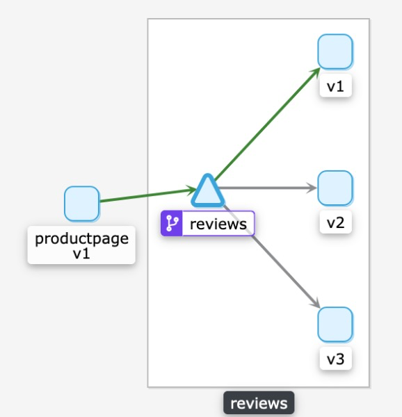
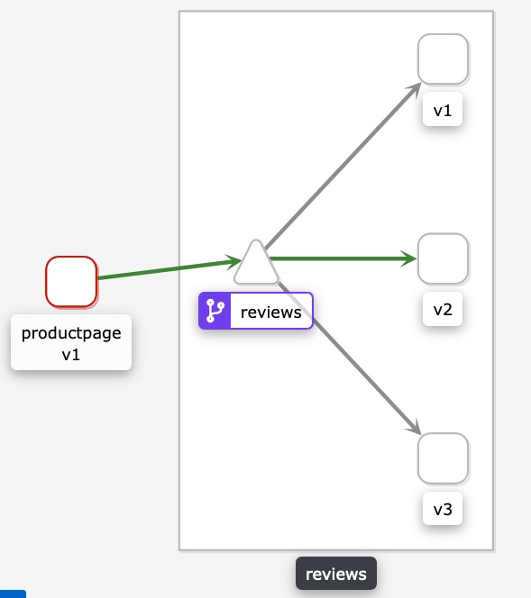

# 高级路由

前面的基础路由、灰度发布和版本管理是对路由进行简单的使用。

下面针对路由进行更详细的介绍。

详细可以查看官方的配置文档

https://istio.io/latest/zh/docs/reference/config/networking/virtual-service/


- http
  - 匹配
    - uri
    - header
  - 重定向
  - 重试
  - 重写
  - 设置header

  

## HTTP

## uri 匹配

前面已经使用了简单的uri匹配, 可以发现是exact属性，代表精确匹配

目前一共支持3中uri匹配

- `exact: "value"` 精确匹配
- `prefix: "value"` 前缀匹配
- `regex: "value" `正则匹配

### Header匹配

header可以根据header进行匹配

bookinfo中的demo中可以看到, 进入登陆之后就可以使headers带上属性end-user = jason

```
apiVersion: networking.istio.io/v1alpha3
kind: VirtualService
metadata:
  name: reviews
  ...
spec:
  hosts:
  - reviews
  http:
  - match:
    - headers:
        end-user:
          exact: jason
    route:
    - destination:
        host: reviews
        subset: v2
  - route:
    - destination:
        host: reviews
        subset: v1
```

未登陆前的访问情况



登陆后的访问情况



### 重定向

HTTPRedirect可用于向调用方发送301重定向响应，在此响应中的授权机构/主机和URI可与指定的值交换。例如，以下规则将评级服务上对/ v1 / getProductRatings API的请求重定向到预订服务提供的/ v1 / bookRatings。

```
apiVersion: networking.istio.io/v1alpha3
kind: VirtualService
metadata:
  name: ratings-route
spec:
  hosts:
  - ratings.prod.svc.cluster.local
  http:
  - match:
    - uri:
        exact: /v1/getProductRatings
    redirect:
      uri: /v1/bookRatings
      authority: newratings.default.svc.cluster.local
...
```

| 属性           | 类型     | 描述                                                         | 必须 |
| -------------- | -------- | ------------------------------------------------------------ | ---- |
| `uri`          | `string` | 在重定向上，使用此值覆盖URL的“路径”部分。请注意，无论将请求URI匹配为确切路径还是前缀，都将替换整个路径。 | 没有 |
| `authority`    | `string` | 在重定向上，使用此值覆盖URL的Authority / Host部分。          | 没有 |
| `redirectCode` | `uint32` | 在重定向上，指定要在重定向响应中使用的HTTP状态代码。默认响应代码为MOVED_PERMANENTLY（301）。 | 没有 |

### 重试

描述HTTP请求失败时要使用的重试策略。例如，以下规则在调用Ratings：v1服务时将最大重试次数设置为3，每次重试尝试超时为2s。

```
apiVersion: networking.istio.io/v1alpha3
kind: VirtualService
metadata:
  name: ratings-route
spec:
  hosts:
  - ratings.prod.svc.cluster.local
  http:
  - route:
    - destination:
        host: ratings.prod.svc.cluster.local
        subset: v1
    retries:
      attempts: 3
      perTryTimeout: 2s
      retryOn: gateway-error,connect-failure,refused-stream
```

| 属性            | 类型       | 描述                                                         | 必须 |
| --------------- | ---------- | ------------------------------------------------------------ | ---- |
| `attempts`      | `int32`    | 给定请求的重试次数。重试之间的时间间隔将自动确定（25毫秒以上）。尝试重试的实际次数取决于httpReqTimeout。 | 是   |
| `perTryTimeout` | `Duration` | 给定请求的每次重试尝试超时。格式：1h / 1m / 1s / 1ms。必须> = 1ms。 | 没有 |
| `retryOn`       | `string`   | 指定重试发生的条件。可以使用“，”分隔列表指定一个或多个策略。有关更多详细信息，请参见[重试策略](https://www.envoyproxy.io/docs/envoy/latest/configuration/http/http_filters/router_filter#x-envoy-retry-on) 和[gRPC重试策略](https://www.envoyproxy.io/docs/envoy/latest/configuration/http/http_filters/router_filter#x-envoy-retry-grpc-on)。 | 没有 |

### 重写

在将请求转发到目标之前，可以使用HTTPRewrite重写HTTP请求的特定部分。重写原语只能与HTTPRouteDestination一起使用。以下示例演示了在进行实际的API调用之前，如何将api调用（/ ratings）的URL前缀重写为Ratings服务。

```
piVersion: networking.istio.io/v1alpha3
kind: VirtualService
metadata:
  name: ratings-route
spec:
  hosts:
  - ratings.prod.svc.cluster.local
  http:
  - match:
    - uri:
        prefix: /ratings
    rewrite:
      uri: /v1/bookRatings
    route:
    - destination:
        host: ratings.prod.svc.cluster.local
        subset: v1
```

| 属性        | 类型     | 描述                                                         | 必须 |
| ----------- | -------- | ------------------------------------------------------------ | ---- |
| `uri`       | `string` | 使用此值重写URI的路径（或前缀）部分。如果原始URI基于前缀匹配，则此字段中提供的值将替换相应的匹配前缀。 | 没有 |
| `authority` | `string` | 用此值重写Authority / Host标头。                             | 没有 |

### 设置header

当Envoy将请求转发到目标服务或来自目标服务的响应时，可以操纵消息头。可以为特定的路由目的地或所有目的地指定头操作规则。以下VirtualService将`test`带有值的标头添加`true` 到路由到任何`reviews`服务目标的请求。它还移动`foo`响应头，但仅移动来自服务`v1`子集（版本）的响应`reviews`。

```
apiVersion: networking.istio.io/v1alpha3
kind: VirtualService
metadata:
  name: reviews-route
spec:
  hosts:
  - reviews.prod.svc.cluster.local
  http:
  - headers:
      request:
        set:
          test: true
    route:
    - destination:
        host: reviews.prod.svc.cluster.local
        subset: v2
      weight: 25
    - destination:
        host: reviews.prod.svc.cluster.local
        subset: v1
      headers:
        response:
          remove:
          - foo
      weight: 75
```

