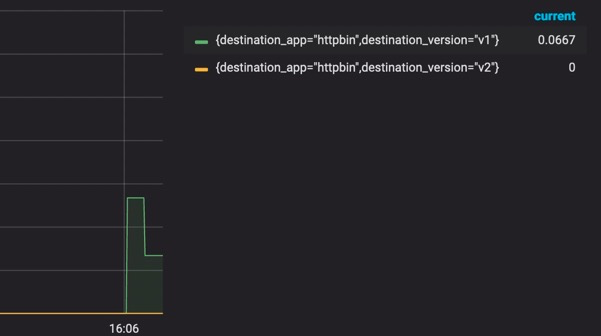
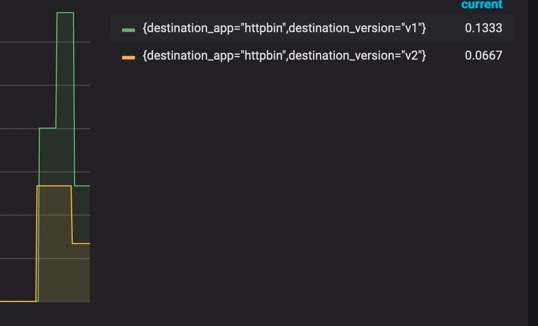
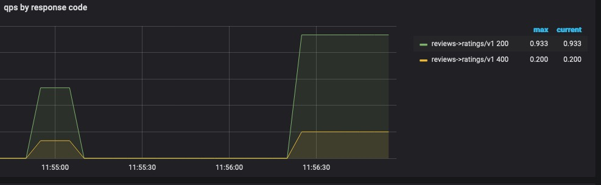

# 混沌工程

**混沌工程，是一种提高技术架构弹性能力的复杂技术手段。**Chaos工程经过实验可以确保系统的可用性。混沌工程旨在将故障扼杀在襁褓之中，也就是在故障造成中断之前将它们识别出来。通过主动制造故障，测试系统在各种压力下的行为，识别并修复故障问题，避免造成严重后果。

这里提供了2种混沌工程的案例。

流量镜像 和 故障注入

## 流量镜像

流量镜像，也称为影子流量，是一个以尽可能低的风险为生产带来变化的强大的功能。镜像会将实时流量的副本发送到镜像服务。镜像流量发生在主服务的关键请求路径之外。

在此任务中，首先把流量全部路由到 v1 版本的测试服务。然后，执行规则将一部分流量镜像到 v2 版本。

在新版本的发布前、可以使用该功能模拟真实线上环境进行测试。

首先创建v1和v2的服务端

```text
cat <<EOF | istioctl kube-inject -f - | kubectl create -f -
apiVersion: apps/v1
kind: Deployment
metadata:
  name: httpbin-v1
spec:
  replicas: 1
  selector:
    matchLabels:
      app: httpbin
      version: v1
  template:
    metadata:
      labels:
        app: httpbin
        version: v1
    spec:
      containers:
      - image: docker.io/kennethreitz/httpbin
        imagePullPolicy: IfNotPresent
        name: httpbin
        command: ["gunicorn", "--access-logfile", "-", "-b", "0.0.0.0:80", "httpbin:app"]
        ports:
        - containerPort: 80
EOF
cat <<EOF | istioctl kube-inject -f - | kubectl create -f -
apiVersion: apps/v1
kind: Deployment
metadata:
  name: httpbin-v2
spec:
  replicas: 1
  selector:
    matchLabels:
      app: httpbin
      version: v2
  template:
    metadata:
      labels:
        app: httpbin
        version: v2
    spec:
      containers:
      - image: docker.io/kennethreitz/httpbin
        imagePullPolicy: IfNotPresent
        name: httpbin
        command: ["gunicorn", "--access-logfile", "-", "-b", "0.0.0.0:80", "httpbin:app"]
        ports:
        - containerPort: 80
EOF
```

创建测试客户端

```text
cat <<EOF | istioctl kube-inject -f - | kubectl create -f -
apiVersion: apps/v1
kind: Deployment
metadata:
  name: sleep
spec:
  replicas: 1
  selector:
    matchLabels:
      app: sleep
  template:
    metadata:
      labels:
        app: sleep
    spec:
      containers:
      - name: sleep
        image: tutum/curl
        command: ["/bin/sleep","infinity"]
        imagePullPolicy: IfNotPresent
EOF
kubectl apply -f - <<EOF
apiVersion: networking.istio.io/v1alpha3
kind: VirtualService
metadata:
  name: httpbin
spec:
  hosts:
    - httpbin
  http:
  - route:
    - destination:
        host: httpbin
        subset: v1
      weight: 100
---
apiVersion: networking.istio.io/v1alpha3
kind: DestinationRule
metadata:
  name: httpbin
spec:
  host: httpbin
  subsets:
  - name: v1
    labels:
      version: v1
  - name: v2
    labels:
      version: v2
EOF
```

初始情况下流量默认全部是v1版本
通过以下查询语句在prometheus或者grafana中进行展示

```text
sum(increase(istio_requests_total{connection_security_policy="mutual_tls",destination_workload_namespace=~"$namespace", destination_app=~"$destination_app"}[30s])) by (destination_version,destination_app)
```

可以看到目前只有v1版本才有流量


尝试将v1版本的流量100%镜像到v2、执行以下命令

```text
 kubectl apply -f - <<EOF
apiVersion: networking.istio.io/v1alpha3
kind: VirtualService
metadata:
  name: httpbin
spec:
  hosts:
    - httpbin
  http:
  - route:
    - destination:
        host: httpbin
        subset: v1
      weight: 100
    mirror:
      host: httpbin
      subset: v2
    mirror_percent: 100
EOF
```


尝试将VirtualService中的mirror_percent改成50后再次进行测试



## 故障注入

### 注入超时

http 请求的超时可以用路由规则的 timeout 字段来指定。 默认情况下，超时是禁用的，本任务中，会把 reviews 服务的超时设置为 1 秒。 为了观察效果，还需要在对 ratings 服务的调用上人为引入 2 秒的延迟

1. 将请求路由到 reviews 服务的 v2 版本，它会发起对 ratings 服务的调用

```
$ kubectl apply -f - <<EOF
apiVersion: networking.istio.io/v1alpha3
kind: VirtualService
metadata:
  name: reviews
spec:
  hosts:
    - reviews
  http:
  - route:
    - destination:
        host: reviews
        subset: v2
EOF
```

2. 给对 ratings 服务的调用添加 2 秒的延迟：

```
$ kubectl apply -f - <<EOF
apiVersion: networking.istio.io/v1alpha3
kind: VirtualService
metadata:
  name: ratings
spec:
  hosts:
  - ratings
  http:
  - fault:
      delay:
        percent: 100
        fixedDelay: 2s
    route:
    - destination:
        host: ratings
        subset: v1
EOF
```

3. 在浏览器中打开 Bookinfo 的网址 `http://$GATEWAY_URL/productpage`。

   这时可以看到 Bookinfo 应用运行正常（显示了评级的星型符号），但是每次刷新页面，都会有 2 秒的延迟。

详细配置可以看文档 https://istio.io/latest/zh/docs/reference/config/networking/virtual-service/#HTTPFaultInjection-Delay

### 注入异常

```
$ kubectl apply -f - <<EOF
apiVersion: networking.istio.io/v1alpha3
kind: VirtualService
metadata:
  name: ratings
spec:
  hosts:
  - ratings
  http:
  - route:
    - destination:
        host: ratings
        subset: v1
    fault:
      abort:
        percentage:
          value: 50
        httpStatus: 400
EOF
```

查看grafana的监控，出现了400的状态码，但是好像百分比不是非常准确，这个问题后面再研究




详细配置可以看文档 https://istio.io/latest/zh/docs/reference/config/networking/virtual-service/#HTTPFaultInjection-Abort

