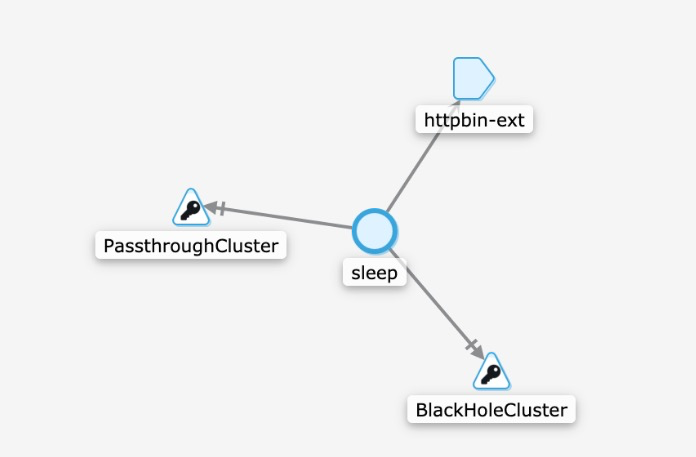
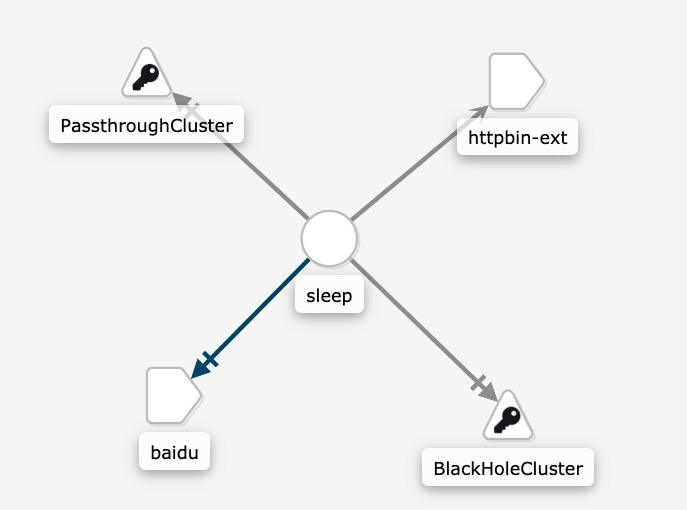

# 出口控制


## istio中有三种方式可以访问外部网络

1. 直接使envoy代理直接访问
2. 配置ServiceEntry以提供对外部服务的受控访问
3. 对于特定范围的IP，绕过Envoy代理。


首先安装sleep案例

```
kubectl apply -f samples/sleep/sleep.yaml
```


### 1 .直接使envoy代理直接访问

可以设置全局流量默认是否允许访问外网

通过设置global.outboundTrafficPolicy.mode` 选项为 `ALLOW_ANY开启，

ALLOW_ANY： 全部允许

REGISTRY_ONLY：封锁策略. 只有注册的服务才允许访问


1.6 以下

```
$ kubectl get configmap istio -n istio-system -o yaml | grep -o "mode: ALLOW_ANY"
mode: ALLOW_ANY
```


1.6 以上 默认没有配置，需要手动加一下, 默认为ALLOW_ANY

```
    outboundTrafficPolicy:
      mode: ALLOW_ANY
```


```
 kubectl exec -it $SOURCE_POD -c sleep -- curl -I https://www.baidu.com | grep  "HTTP/"; 
```

如果设置的是ALLOW_ANY, 那么返回

```
HTTP/2 200
```

如果设置的是REGISTRY_ONLY, 那么返回

```
 command terminated with exit code 35
```

###  

### 2. 配置ServiceEntry以提供对外部服务的受控访问

首先需要更改为封锁策略，默认让所有无法访问外部

创建一个ServiceEntry资源

```
$ kubectl apply -f - <<EOF
apiVersion: networking.istio.io/v1alpha3
kind: ServiceEntry
metadata:
  name: httpbin-ext
spec:
  hosts:
  - httpbin.org
  ports:
  - number: 80
    name: http
    protocol: HTTP
  resolution: DNS
  location: MESH_EXTERNAL
EOF
```

```
$  kubectl exec -it $SOURCE_POD -c sleep -- curl http://httpbin.org/headers
{
  "headers": {
  "Accept": "*/*",
  "Connection": "close",
  "Host": "httpbin.org",
  "User-Agent": "curl/7.60.0",
  ...
  "X-Envoy-Decorator-Operation": "httpbin.org:80/*",
  }
}
```

然后可以在kiali上面观测到如下，sleep访问了httpbin-ext



访问 https服务

```
$ kubectl apply -f - <<EOF
apiVersion: networking.istio.io/v1alpha3
kind: ServiceEntry
metadata:
  name: baidu
spec:
  hosts:
  - www.baidu.com
  ports:
  - number: 443
    name: https
    protocol: HTTPS
  resolution: DNS
  location: MESH_EXTERNAL
EOF
```

```
$ kubectl exec -it $SOURCE_POD -c sleep -- curl -I https://www.baidu.com | grep  "HTTP/"
HTTP/2 200
```



另外可以通过配置全部通过

```
$ kubectl apply -f - <<EOF
apiVersion: networking.istio.io/v1alpha3
kind: ServiceEntry
metadata:
  name: all-traffic
spec:
  hosts:
  - example.com # this is ignored according to docs
  addresses:
  - 0.0.0.0/0
  ports:
  - name: http
    number: 80
    protocol: tcp
  - name: https
    number: 443
    protocol: tcp
  location: MESH_EXTERNAL
  resolution: NONE
EOF
```


#### 外部访问规则

配置ServiceEntry以后，外部服务已经和内部服务没有区别，你完全可以把它当做一个内部服务使用，比如设置VirtualService 设置超时

```
$ kubectl apply -f - <<EOF
apiVersion: networking.istio.io/v1alpha3
kind: VirtualService
metadata:
  name: httpbin-ext
spec:
  hosts:
    - httpbin.org
  http:
  - timeout: 3s
    route:
      - destination:
          host: httpbin.org
        weight: 100
EOF
```

```
$ kubectl exec -it $SOURCE_POD -c sleep -- time curl -o /dev/null -s -w "%{http_code}\n" http://httpbin.org/delay/5
504

real    0m3.149s
user    0m0.004s
sys     0m0.004s
```


### 3. 对于特定范围的IP，绕过Envoy代理。

比如集群内部的ip网段，需要访问，避免经过istio，可以直接配置如下

```
--set global.proxy.includeIPRanges="10.96.0.0/12"
```

