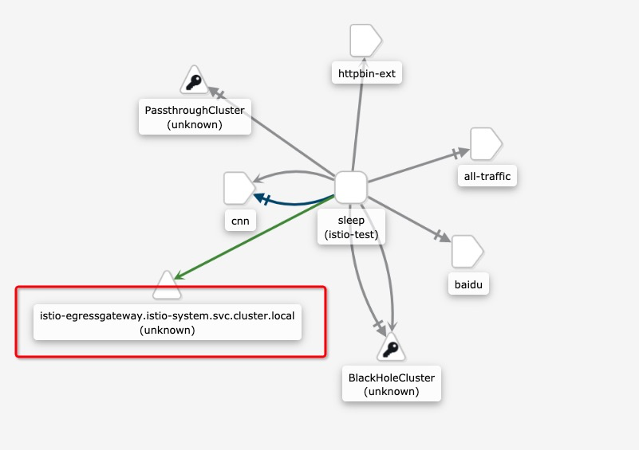

# 出口网关


在原生k8s中，并不存在出口网关，如果访问外部网络访问的流量直接通过当前服务器节点出去。这样就会存在一些问题。暂时不考虑硬件级别的出口网关

## 使用场景

- 设想一个对安全有严格要求的组织。要求服务网格所有的出站流量必须经过一组专用节点。专用节点运行在专门的机器上，与集群中运行应用程序的其他节点隔离。这些专用节点用于实施 egress 流量的策略，并且受到比其余节点更严密地监控。
- 另一个使用场景是集群中的应用节点没有公有 IP，所以在该节点上运行的网格 service 无法访问互联网。通过定义 egress gateway，将公有 IP 分配给 egress gateway 节点，用它引导所有的出站流量，可以使应用节点以受控的方式访问外部服务。


## 安装案例

```
kubectl apply -f samples/sleep/sleep.yaml
```

```
export SOURCE_POD=$(kubectl get pod -l app=sleep -o jsonpath={.items..metadata.name})
```


## 定义 Egress gateway 并引导 HTTP 流量

1. 为 `edition.cnn.com` 定义一个 `ServiceEntry`

```
$ kubectl apply -f - <<EOF
apiVersion: networking.istio.io/v1alpha3
kind: ServiceEntry
metadata:
  name: cnn
spec:
  hosts:
  - edition.cnn.com
  ports:
  - number: 80
    name: http-port
    protocol: HTTP
  - number: 443
    name: https
    protocol: HTTPS
  resolution: DNS
EOF
```

2. 发送 HTTPS 请求到 https://edition.cnn.com/politics，验证 `ServiceEntry` 是否已正确应用。

```
$ kubectl exec -it $SOURCE_POD -c sleep -- curl -sL -o /dev/null -D - http://edition.cnn.com/politics
HTTP/1.1 301 Moved Permanently
...
location: https://edition.cnn.com/politics
...

HTTP/1.1 200 OK
Content-Type: text/html; charset=utf-8
...
Content-Length: 151654
...
```

3. 为 `edition.cnn.com` 端口 80 创建 egress `Gateway`。并为指向 egress gateway 的流量创建一个 destination rule。

```
$ kubectl apply -f - <<EOF
apiVersion: networking.istio.io/v1alpha3
kind: Gateway
metadata:
  name: istio-egressgateway
spec:
  selector:
    istio: egressgateway
  servers:
  - port:
      number: 80
      name: http
      protocol: HTTP
    hosts:
    - edition.cnn.com
---
apiVersion: networking.istio.io/v1alpha3
kind: DestinationRule
metadata:
  name: egressgateway-for-cnn
spec:
  host: istio-egressgateway.istio-system.svc.cluster.local
  subsets:
  - name: cnn
EOF
```


4. 定义一个 `VirtualService`，将流量从 sidecar 引导至 egress gateway，再从 egress gateway 引导至外部服务：

```
$ kubectl apply -f - <<EOF
apiVersion: networking.istio.io/v1alpha3
kind: VirtualService
metadata:
  name: direct-cnn-through-egress-gateway
spec:
  hosts:
  - edition.cnn.com
  gateways:
  - istio-egressgateway
  - mesh
  http:
  - match:
    - gateways:
      - mesh
      port: 80
    route:
    - destination:
        host: istio-egressgateway.istio-system.svc.cluster.local
        subset: cnn
        port:
          number: 80
      weight: 100
  - match:
    - gateways:
      - istio-egressgateway
      port: 80
    route:
    - destination:
        host: edition.cnn.com
        port:
          number: 80
      weight: 100
EOF
```

4. 再次发送 HTTP 请求到 https://edition.cnn.com/politics。

```
$ kubectl exec -it $SOURCE_POD -c sleep -- curl -sL -o /dev/null -D - http://edition.cnn.com/politics
HTTP/1.1 301 Moved Permanently
...
location: https://edition.cnn.com/politics
...

HTTP/1.1 200 OK
Content-Type: text/html; charset=utf-8
...
Content-Length: 151654
...
```





## 总结

看起来创建的资源比较多，其实相对于入口就多了一个egressgateway注册外部服务。
