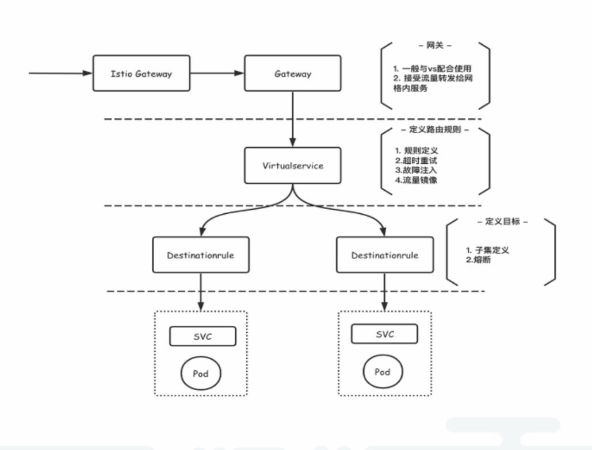

能做什么

- 灰度发布

- 混沌工程

资源对象

- 网关 Gateway

- 虚拟服务 VirtualService

  通过路由规则，指定流量到哪一个服务(service)

- 目标规则 DestinationRule

  定义服务的集合，多个pod，多个版本

- 服务入口

  

  

####  应用场景

内部访问 

VirtualService + DestinationRule

VirtualService 指定到访问到哪一个service、哪个版本  ;  DestinationRule 描述该service的版本情况

外部访问: 

Gateway + VirtualService + DestinationRule

Gateway指定入口的istio-ingress(可能会存在多个)，后面就是gateway 到 服务的内部访问，和上面相同

#### 和k8s ingress的区别

k8s ingress 只是实现了网关到服务的路由(相当于gateway到服务 的VirtualService)。无法实现服务版本的控制。