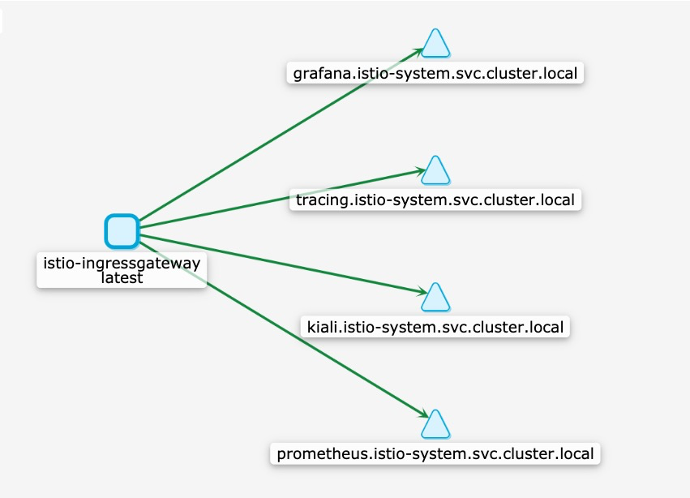

# 通过gateway访问webui

通常在K8s的环境中，我们会使用ingress访问内部环境，在安装istio以后，就可以使用istio的ingress-gateway进行访问

首先已经将*.istio.k8stest.top这个域名解析到当前服务器，

```
kubectl apply -f samples/gateway/gateway.yaml
```


然后就可以打开kiali、grafana、prometheus、jaeger 的webui界面


链接如下

http://jaeger.istio.k8stest.top:30000

http://grafana.istio.k8stest.top:30000

http://prometheus.istio.k8stest.top:30000

http://kiali.istio.k8stest.top:30000



