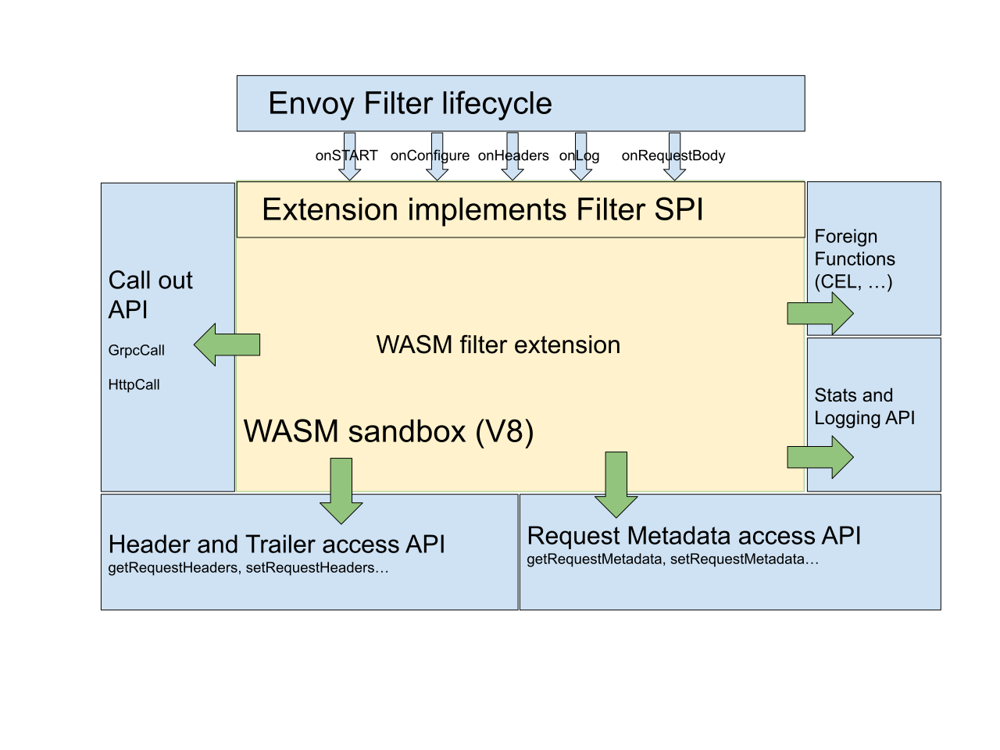

# WebAssembly

## WebAssembly 是什么？

[WebAssembly](https://webassembly.org/)（Wasm）是一种可移植的字节码格式，用于以接近本机的速度执行以[多种语言](https://github.com/appcypher/awesome-wasm-langs)编写的代码。其最初的[设计目标](https://webassembly.org/docs/high-level-goals/)与上述挑战完全吻合，并且在其背后得到了可观的行业支持。Wasm是在所有主要浏览器中本机运行的第四种标准语言

WebAssembly 同时是一种沙盒技术，可以用于扩展 Istio 代理（Envoy）的能力。Proxy-Wasm 沙盒 API 取代了 Mixer 作为 Istio 主要的扩展机制。在 Istio 1.6 中将会为 Proxy-Wasm 插件提供一种统一的配置 API。

WebAssembly 沙盒的目标：

- **效率** - 这是一种低延迟，低 CPU 和内存开销的扩展机制。

- **功能** - 这是一种可以执行策略，收集遥测数据和执行有效荷载变更的扩展机制。

- **隔离** - 一个插件中程序的错误或是崩溃不会影响其它插件。

- **配置** - 插件使用与其它 Istio API 一致的 API 进行配置。可以动态的配置扩展。

- **运维** - 扩展可以以仅日志，故障打开或者故障关闭的方式进行访问和部署。

- **扩展开发者** - 可以用多种编程语言编写。

  

Istio 扩展（Proxy-Wasm 插件）有几个组成部分：

- **过滤器服务提供商接口** 用于为过滤器构建 Proxy-Wasm 插件。
- **沙盒** 在 Envoy 中嵌入 V8 Wasm 运行时。
- **主机 API** 用于处理请求头，尾和元数据。
- **调出 API** 针对 gRPC 和 HTTP 请求。
- **统计和记录 API** 用于度量统计和监控。

## WebAssembly Hub

Wasm的好处之一是能够用多种语言编写模块。Solo.io与Google之间的合作为以C ++，Rust和AssemblyScript编写的Envoy过滤器提供了开箱即用的支持。我们将继续增加对更多语言的支持。

Wasm扩展使用部署它们的Envoy代理内的应用程序二进制接口（ABI）。WebAssembly Hub在Envoy，Istio和Gloo之间提供了强大的ABI版本保证，以防止不可预测的行为和错误。您只需担心的是编写扩展代码。

使用Wasm扩展Envoy可以为我们带来几个主要好处：

- 敏捷性：可以使用Istio控制平面在运行时交付和重新加载扩展。这样就可以快速进行扩展的开发→测试→发布周期，而无需Envoy的推出。
- 库存发布：合并到主树中之后，Istio和其他人将能够使用Envoy的库存发布，而不是自定义版本。这也将使Envoy社区有更多的时间将某些内置扩展迁移到该模型，从而减少其受支持的占地面积。
- 可靠性和隔离性：扩展部署在具有资源限制的沙箱中，这意味着它们现在可以崩溃或泄漏内存，而无需降低整个Envoy进程。CPU和内存使用率也可能受到限制。
- 安全性：沙盒具有用于与Envoy进行通信的明确定义的API，因此扩展只能访问并可以修改连接或请求的有限数量的属性。此外，由于Envoy介导了此交互，因此它可以隐藏或清除扩展中的敏感信息（例如，“ Authorization”和“ Cookie” HTTP标头或客户端的IP地址）。
- 灵活性：[可以将30多种编程语言编译为WebAssembly](https://github.com/appcypher/awesome-wasm-langs)，从而允许来自不同背景的开发人员（C ++，Go，Rust，Java，TypeScript等）以他们选择的语言编写Envoy扩展。