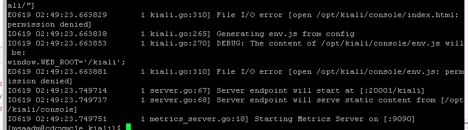
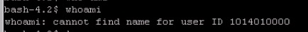
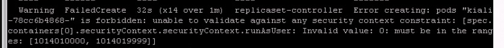
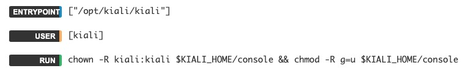

# kiali permission denied in openshift

kiali在openshift环境中出现permission denied的问题，无法打开web ui


kiali版本1.19



当前是以1014010000用户运行的



设置了psp，只允许一定范围的用户uid



发现低版本(0.15)是不存在这个问题。

对比了一下

发现新版本是以kiali用户进行启动



旧版本就没有，直接以root方式运行。

## 原因

openshift 中的 scc，设置了用户范围为1014010000-1014019999，pod使用service account，pod启动的用户未scc最小范围也就是1014010000。而dockerfile中设置了文件归属用户kiali(uid为1000)，uid不匹配，所以提示没有权限

## 解决方案 

修改kiali镜像

```
From quay.io/kiali/kiali:v1.19

USER root
RUN chown -R 1014010000:1014010000 $KIALI_HOME/console && chmod -R g=u $KIALI_HOME/console
```


