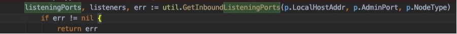
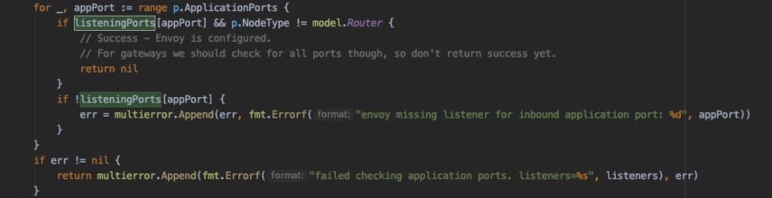
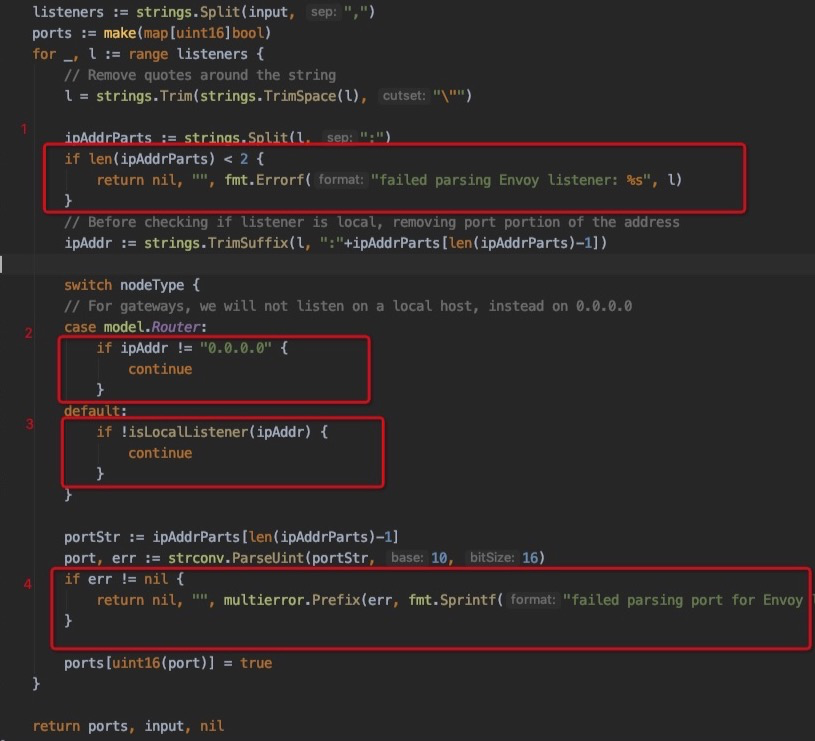
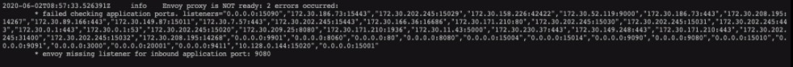

# sidecar 503
版本 1.2.5

错误日志
```
* failed checking application ports. 
...
listeners="0.0.0.0:15090","172.30.187.75:5000","172.30.101.92:30011","172.30.243.138:8090","172.30.178.247:10909","172.30.86.162:8080","172.30.151.172:8080","172.30.159.133:5000","172.30.101.58:8080","172.30.138.34:8443","172.30.137.218:5000","172.30.69.168:8080","172.30.41.115:8080","172.30.37.190:6379","172.30.13.46:8778","172.30.146.29:8080","172.30.124.52:6379","172.30.87.151:8080","172.30.176.6:8443","172.30.132.128:8443","172.30.157.82:10909","172.30.216.60:8080","172.30.241.194:3306","172.30.248.59:8180","172.30.34.5:8080","172.30.74.236:30012","172.30.71.196:8080","172.30.175.175:8080","172.30.105.139:8443","172.30.57.208:10909","172.30.16.10:8080","172.30.242.109:8180","172.30.165.59:8080","172.30.38.24:8081","172.30.153.146:8080","172.30.242.234:80","172.30.20.138:8080","172.30.84.179:8091","172.
...
* envoy missing listener for inbound application port: 8080
```

代码路径
pilot-agent/status/ready/probe.go checkInboundConfigured()

首先进入该方法
checkInboundConfigured() 



然后调用GetInboundListeningPorts() 通过调用15000/listeners获取，返回listeningPorts 均为true


最后循环p.ApplicationPorts，如果listeningPorts不在里面那么就提示“envoy missing listener ”



 p.ApplicationPorts由启动参数“--applicationPorts”进行配置

打印的日志envoy missing listener for inbound application port: 8080 
与参数--applicationPorts="[8080]" 相匹配，说明GetInboundListeningPorts返回的listeningPorts不包含key 8080端口


再次回到GetInboundListeningPorts
有2种可能性
1. 没有获取到8080端口
2. 在某一处被过滤掉了

图中1和4没有发现错误日志，2是gateway条件不满足，
3 可以根据input中打印出来的ip和podip进行对比判断得出结论



#### 分析
有很大可能性是因为pilot没有将该pod对应的service进行服务注册

1. 没有创建相应的service
2. pilot异常

## 验证

删除相应的service，然后重启pod，查看sidecar日志
